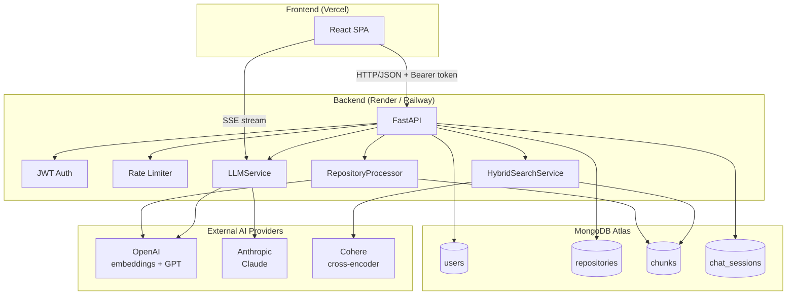
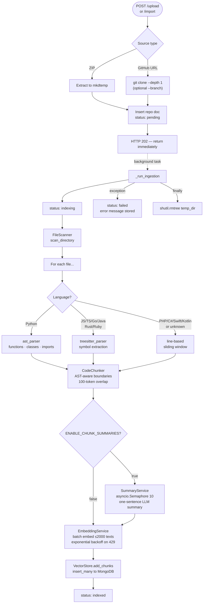
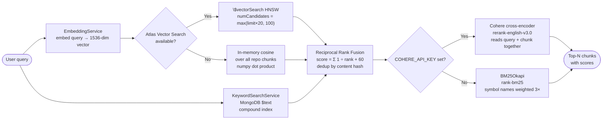
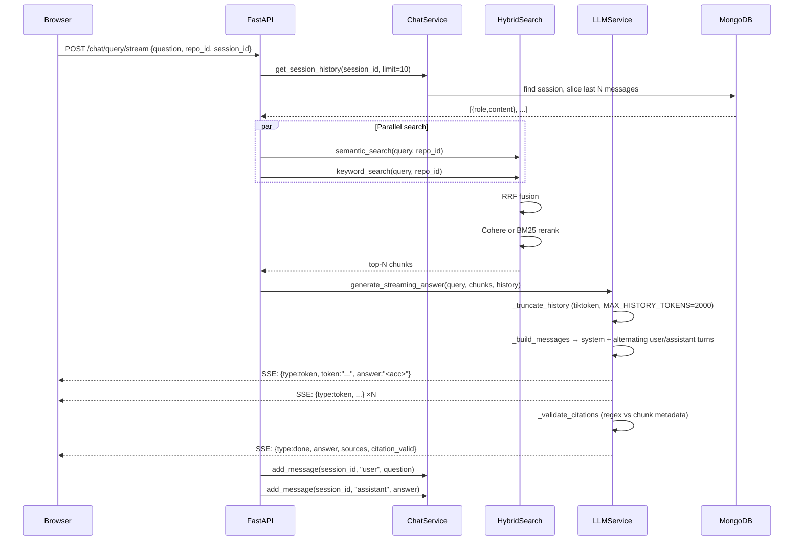
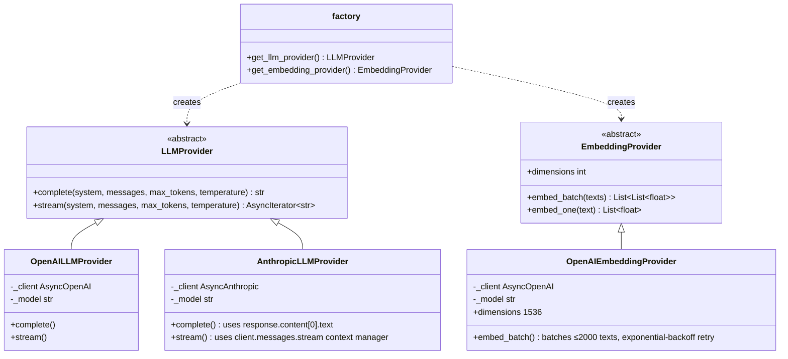
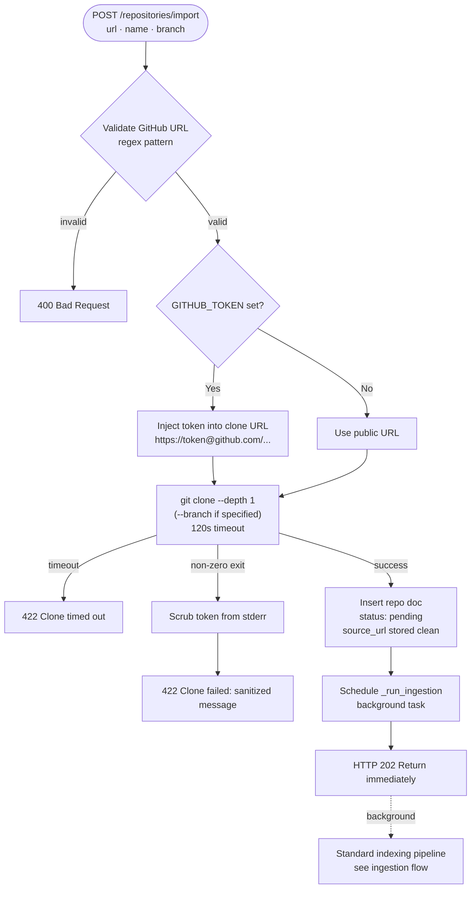
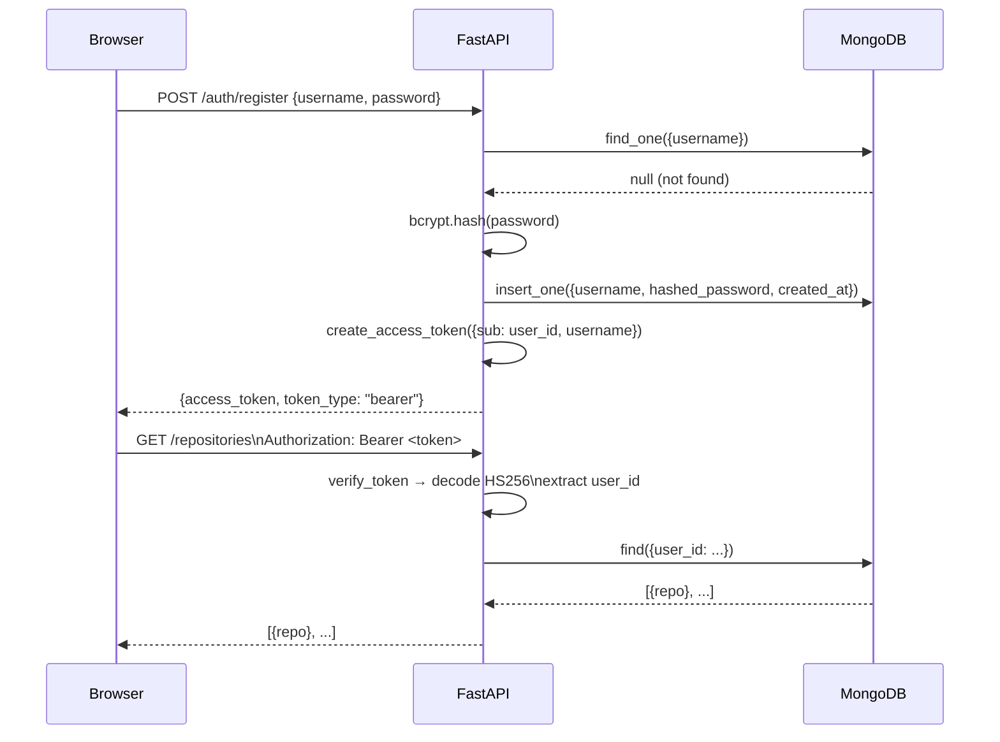

# Architecture

This document describes the technical architecture of the AI Codebase Assistant — every major component, how they connect, and why they were designed the way they were.

---

## Table of Contents

- [System Overview](#system-overview)
- [Repository Ingestion Flow](#repository-ingestion-flow)
- [Search Pipeline](#search-pipeline)
- [RAG Query Flow](#rag-query-flow)
- [Provider Abstraction](#provider-abstraction)
- [GitHub Import Flow](#github-import-flow)
- [Authentication Flow](#authentication-flow)
- [Database Schema](#database-schema)
- [Service Reference](#service-reference)

---

## System Overview

The application is a four-layer system: a React SPA talking to a FastAPI backend, which orchestrates a MongoDB Atlas database and external AI APIs.



**Key design decisions:**
- **FastAPI lifespan singletons**: `RepositoryProcessor`, `KeywordSearchService`, and `RAGPipeline` are instantiated once at startup on `app.state` and shared across requests — avoids per-request connection overhead.
- **Async throughout**: all database I/O uses Motor (async MongoDB driver), all LLM calls use async SDK clients. `asyncio.gather` runs parallel operations (semantic + keyword search) concurrently.
- **Provider abstraction**: `LLMProvider` and `EmbeddingProvider` abstract interfaces allow switching between OpenAI and Anthropic with an environment variable — no code changes required.
- **Graceful degradation**: Atlas vector search → in-memory cosine fallback; Cohere re-ranking → BM25 fallback. Each layer works independently.

---

## Repository Ingestion Flow

Upload (ZIP or GitHub clone) triggers an async background task. The HTTP request returns 202 immediately; clients poll `GET /repositories/{id}/status`.



**Incremental re-indexing** (`POST /repositories/{id}/reindex`):
1. Load all existing `(file_path, file_hash)` pairs from stored chunks
2. Compute MD5 hashes for every current file
3. Delete chunks for changed or removed files
4. Re-embed only changed files — unchanged files produce **zero API calls**

---

## Search Pipeline

Every query runs semantic and keyword search in parallel, merges them with RRF, then re-ranks.



**Why Reciprocal Rank Fusion?**
RRF is a parameter-free fusion algorithm: `score(d) = Σ 1/(rank(d) + k)` where `k=60`. It correctly handles the case where a document appears in both result sets (ranks from both lists contribute), and is not sensitive to the absolute score values of either search method. This makes it robust even when semantic similarity scores and text relevance scores are on completely different scales.

**Keyword index weights**: `{"metadata.name": 5, "content": 1}`. Symbol names (function names, class names) rank 5× higher than body text matches, so `search_function_names("authenticate")` surfaces the right chunk even when its body doesn't mention "authenticate" heavily.

---

## RAG Query Flow

End-to-end flow from question to streamed answer. This is the authoritative detailed version — [README.md](README.md#architecture) has a simplified overview for quick orientation.



**Citation validation**: After the full answer is assembled, a regex extracts all file paths with extensions (`.py`, `.js`, `.ts`, `.tsx`, `.jsx`, `.go`, `.java`, `.rs`, `.rb`) from the LLM output. Each cited path is checked against the `file_path` fields in the retrieved chunks. Unverified citations are collected into `citation_warnings` and a blockquote warning is appended to the answer.

**Chat history**: Stored as an embedded array in the `chat_sessions` document. The last N messages are loaded as alternating `{"role": "user"/"assistant", "content": "..."}` turns in the messages array — the native format for both OpenAI and Anthropic APIs. History is token-counted with tiktoken and truncated from the oldest pair when it exceeds `MAX_HISTORY_TOKENS`.

---

## Provider Abstraction

The `LLMProvider` and `EmbeddingProvider` abstract interfaces decouple the application from any specific AI vendor. Switch providers with environment variables, no code changes required.



**How the factory works**: `get_llm_provider()` reads the `LLM_PROVIDER` environment variable and returns the appropriate concrete implementation. If the required API key is missing, it raises `ValueError` at startup rather than failing silently on the first request.

**API shape differences handled by providers**:
- OpenAI: system message is prepended as `{"role": "system", "content": "..."}` in the messages array
- Anthropic: `system` is a top-level parameter; `response.content[0].text` is the output; streaming uses `client.messages.stream()` context manager

See [docs/provider-architecture.md](docs/provider-architecture.md) for how to add a new provider.

---

## GitHub Import Flow



**Security details:**
- The GitHub token is injected into the clone URL only in memory: `https://<token>@github.com/owner/repo`. It is never logged or stored.
- If the clone fails, `token` is replaced with `***` in the stderr output before returning the error to the client.
- The `source_url` stored in the database is the clean `https://github.com/owner/repo` form — no credentials.

---

## Authentication Flow



**Token details:**
- Algorithm: HS256
- Expiry: 24 hours (`exp` claim)
- Payload fields: `sub` (user_id string), `username`, `iat`, `exp`
- Secret: `JWT_SECRET` environment variable — must be a strong random string in production
- No refresh token flow — users re-authenticate after 24 hours

---

## Database Schema

### `users`
```
_id           ObjectId
username      string — unique indexed
password      string — bcrypt hash ($2b$...)
created_at    ISODate
```

### `repositories`
```
_id           ObjectId
name          string
description   string
user_id       string — references users._id (stored as string)
source_url    string — GitHub URL (clean, no token) — present on imported repos
status        string — "pending" | "indexing" | "indexed" | "failed"
processing    object — {files_processed, chunks_created, ...} from processor
error         string — present on failure
created_at    ISODate
updated_at    ISODate | null
```

### `chunks`
```
_id              ObjectId
repository_id    string — references repositories._id
content          string — raw source code
embedding        [1536 floats] — OpenAI text-embedding-3-small
metadata:
  file_path      string — relative path within repo (e.g., "src/auth.py")
  chunk_type     string — "function" | "class" | "imports" | "code_block"
  name           string — function or class name
  start_line     int
  end_line       int
  token_count    int — tiktoken cl100k_base count
  file_hash      string — MD5 of file content (used for incremental re-indexing)
  summary        string — LLM-generated summary (only when ENABLE_CHUNK_SUMMARIES=true)
```

**Indexes on `chunks`:**
- `repository_id_1` — standard index for filtering by repo
- `content_name_text_index` — compound text index: `content` (weight 1) + `metadata.name` (weight 5)
- `vector_search_index` — Atlas HNSW vector index (created manually in Atlas UI)

### `chat_sessions`
```
_id              ObjectId
user_id          string — references users._id
repository_id    string — references repositories._id
messages         array:
  role           string — "user" | "assistant"
  content        string
  timestamp      ISODate
created_at       ISODate
updated_at       ISODate
```

Messages are stored as an embedded array — efficient for reading the last N messages with a single document fetch. The `$push` operator appends new messages atomically.

---

## Service Reference

| Service | File | Responsibility |
|---|---|---|
| `FileScanner` | `services/file_scanner.py` | Walk directory tree, return code files (15 extensions). Skip venv, node_modules, dist, etc. |
| `ASTParser` | `services/ast_parser.py` | Python `ast` — extract functions, async functions, classes, imports with exact line ranges |
| `TreeSitterParser` | `services/treesitter_parser.py` | tree-sitter grammars — JS/TS/Go/Java/Rust/Ruby symbol extraction |
| `CodeChunker` | `services/chunker.py` | Create chunks from parsed symbols; split oversized chunks with token-based overlap |
| `SummaryService` | `services/summary.py` | Optionally generate one-sentence LLM summaries per chunk (concurrency-limited with `asyncio.Semaphore(10)`) |
| `EmbeddingService` | `services/embedding.py` | Thin wrapper over `EmbeddingProvider.embed_batch()` |
| `VectorStore` | `services/vector_store.py` | `add_chunks` (embed + insert), `semantic_search` (Atlas or in-memory), `delete_by_repository` |
| `KeywordSearchService` | `services/keyword_search.py` | MongoDB `$text` search; `search_function_names`, `search_class_names`, `get_search_suggestions` |
| `HybridSearchService` | `services/hybrid_search.py` | Parallel search → RRF fusion → Cohere/BM25 rerank |
| `LLMService` | `services/llm_service.py` | Build messages, call provider, stream tokens, validate citations |
| `ChatService` | `services/chat_service.py` | Session + message CRUD against MongoDB `chat_sessions` collection |
| `RepositoryProcessor` | `services/processor.py` | Orchestrate full ingestion and incremental re-indexing; call `_enrich_with_summaries` if enabled |
| `RAGPipeline` | `services/rag_pipeline.py` | Top-level orchestrator: history → search → LLM → format sources |
| `LLMProvider` / `EmbeddingProvider` | `services/providers/base.py` | Abstract interfaces |
| `OpenAILLMProvider` | `services/providers/openai_provider.py` | OpenAI completion + streaming |
| `AnthropicLLMProvider` | `services/providers/anthropic_provider.py` | Anthropic Claude completion + streaming |
| `OpenAIEmbeddingProvider` | `services/providers/openai_provider.py` | Batch embedding with retry |
| `factory` | `services/providers/factory.py` | `get_llm_provider()`, `get_embedding_provider()` read env vars |
