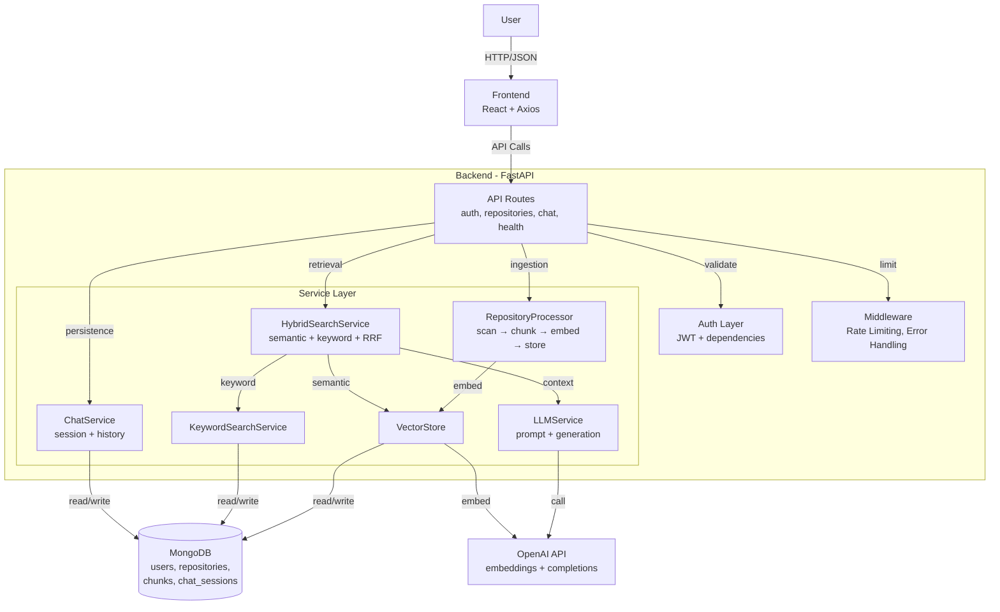

# AI Codebase Assistant

Minimal full-stack RAG app that lets users upload a repository as ZIP, ask questions about code, and receive answers with source references.

## What Is Implemented

- JWT-based auth with username/password register and login
- Repository management with per-user access control
- ZIP upload and repository ingestion
- Python AST-based chunking (functions, classes, imports)
- Embedding generation with OpenAI text-embedding-3-small
- Hybrid retrieval:
  - Semantic search (cosine similarity over stored embeddings)
  - MongoDB text search
  - Reciprocal Rank Fusion (RRF) + reranking bonus
- LLM answer generation with source metadata
- Chat sessions with persistent history in MongoDB
- Rate limiting and centralized error handling
- React frontend for login, upload, repository selection, and Q&A

## Architecture

### Architecture Notes

- Frontend handles authentication, ZIP upload, repository selection, and question submission.
- API layer validates requests and enforces authorization/rate limits before business logic.
- RepositoryProcessor runs ingestion pipeline and stores chunked, embedded code in MongoDB.
- HybridSearchService combines semantic and keyword retrieval, then passes context to LLMService.
- ChatService stores multi-turn history and links sessions to repositories.

### Backend Layers

- API routes:
  - auth: register/login
  - repositories: CRUD + ZIP upload
  - chat: sessions + query
- Core services:
  - RepositoryProcessor: scan -> chunk -> embed -> store
  - VectorStore: embeddings persistence + semantic similarity search
  - KeywordSearchService: Mongo text-index based retrieval
  - HybridSearchService: merges semantic + keyword results with RRF
  - LLMService: prompt assembly and answer generation
  - ChatService: session/message persistence
- Cross-cutting:
  - JWT verification dependencies
  - SlowAPI rate limiter
  - Standardized error handlers

## End-to-End Workflow

### 1) Ingestion Flow

1. Authenticated user uploads ZIP.
2. Backend extracts ZIP to temp directory.
3. Scanner finds code files (multiple extensions), then processor currently chunks only Python files.
4. Python AST parser extracts functions/classes/imports.
5. Chunker creates structured chunks and token counts.
6. Embedding service creates vectors.
7. Vector store writes chunks and metadata to MongoDB.

### 2) Query Flow

1. User sends question with repository_id.
2. Optional session history is loaded.
3. Hybrid search runs:
   - semantic search on embeddings
   - keyword search using Mongo text indexes
4. Results are fused and reranked.
5. LLM receives question + retrieved context.
6. Answer is returned with sources (file_path, lines, type, name, score).
7. If session_id is present, user/assistant messages are saved.

## API Summary

Auth:
- POST /auth/register
- POST /auth/login

Repositories:
- GET /repositories
- GET /repositories/{repo_id}
- POST /repositories
- POST /repositories/upload
- PUT /repositories/{repo_id}
- DELETE /repositories/{repo_id}

Chat:
- POST /chat/sessions
- GET /chat/sessions
- GET /chat/sessions/{session_id}
- GET /chat/sessions/{session_id}/history
- DELETE /chat/sessions/{session_id}
- POST /chat/query

System:
- GET /
- GET /health

## Project Structure

- backend: FastAPI app, services, models, auth, middleware
- frontend: React app (single-page UI)
- docs: supplementary architecture and API notes
- PHASES.md / SYSTEM_FLOW.md / STRICT.md: learning and execution guides

## Quick Start

### Backend

1. Create and activate virtual environment.
2. Install dependencies from backend/requirements.txt.
3. Set environment variables:
   - OPENAI_API_KEY
   - MONGODB_URI
   - JWT_SECRET
   - optional: ALLOWED_ORIGINS, LLM_MODEL, LLM_MAX_TOKENS, GITHUB_TOKEN
4. Run FastAPI app:
   - uvicorn backend.main:app --reload

### Frontend

1. Install dependencies in frontend.
2. Run dev server:
   - npm run dev
3. Frontend expects backend at http://localhost:8000.

## Current Limitations

- Ingestion/chunking pipeline currently indexes Python files only.
- Semantic search is performed in application memory over repository chunks (not Atlas vector index).
- GitHub integration service exists, but GitHub import endpoints are not exposed in API routes yet.
- Frontend uses basic single-page flow and does not yet expose session lifecycle management.

## Notes

Use this README as the source of truth for what is implemented now. Extended design ideas can remain in docs files.
